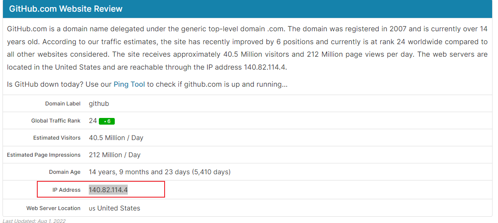

# 一:更改Host

## 1.报错原因:

**Failed to connect to github.com port 443: Timed out**

## 2.修改步骤

1.打开ipaddress.com
2.输入github.com
3.复制IP Address

4.打开C:\Windows\System32\drivers\etc\hosts
5.添加  **140.82.114.4 github.com**  到末尾

